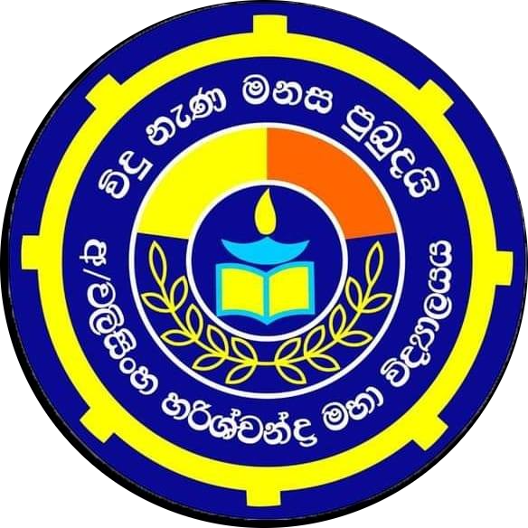
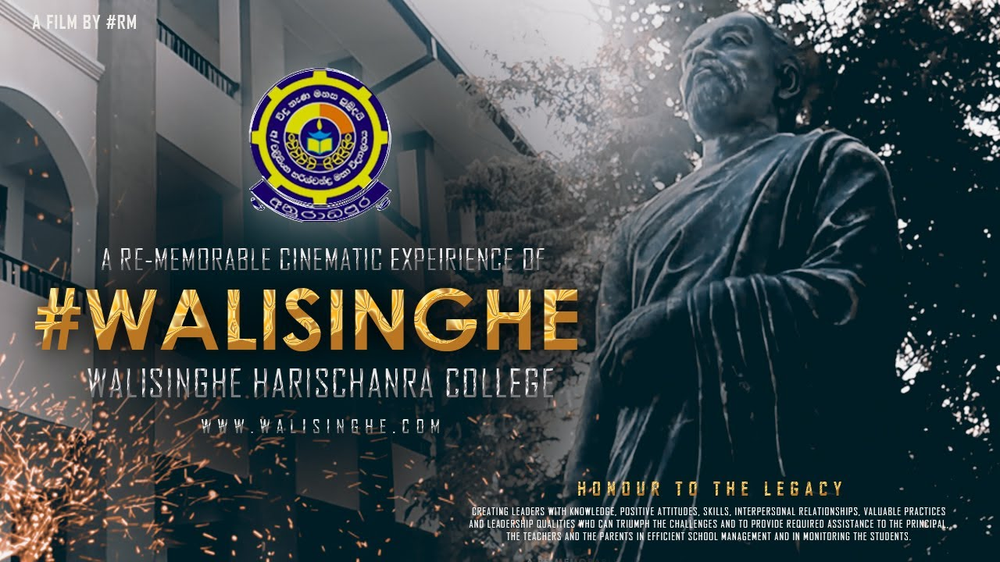

  

<h1 align="center">Walisinghe Harischandra College</h1>

  A premier educational institution nurturing excellence and leadership & proudly producing thousands of good citizens and great intellectuals who will contribute phenomenal service for the enrichment of nation.

---

  

---

## 🌟 Vision

 - Becoming a Model School in the Field of Public Education.

## 🎯 Mission

 - To Endow the Society with a Person Who Works With a Clear Mind, Mutual Harmony, Moral Pride, Strong Determination & Responsibility

## 📚 On School

- Walisingha Harischanda M.V. is located at the heart of the ancient kingdom of Sri Lanka. It belongs to the North Central province, the division of Nuwaragam Palath East. The school was established on 7th September 1955. It was named as Walisingha Harischandra M.V. in order to tribute Brahmachari Walisingha. This is a school which was started with 200 students including 07 teachers as a primary school of the central college of Anuradhapura. The first principal was Mr K.D. Jayathilake. As time passed, it was converted into an independent school in 1981. The pioneer personality was Brahmachari Walisingha to establish it. Now, this school has become the most eminent leading school in Anuradhapura.
  
## ⚜️ Principal's Message
 - Walisinghe Harischandra National College (WHC) is one of the best public schools in Sri Lanka. Since the inception of school in 1956 as a mixed Buddhist School, the past principals tirelessly committed in pursuing the vision of the school to harness and nurture rich ethical values enshrined in Buddhist philosophy.
     The school has proudly produced thousands of good citizens and great intellectuals who have contributed phenomenal service for the enrichment of nation. At present more than 5000 students are studying under the guidance of well-trained 215 teachers.
     The school is a great hub for various extracurricular activities including sports, games, performing arts, an array of clubs and societies, projects and events. Our students are our strength and inspiration. The active participation of the old boy association and the school development society are highly commendable.
     I invite all the well-wishers to join hands with the school and be our strength to move ahead with our motto ‘විදු නැණ මනස පුබුදයි’ – The Education Enlightens the Mind.  

---

© 2025 Walisinghe Harischandra College. All rights reserved.

